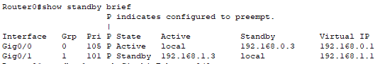
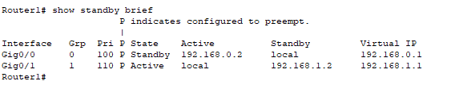
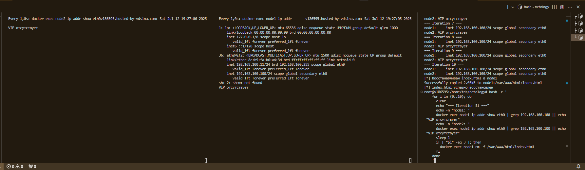
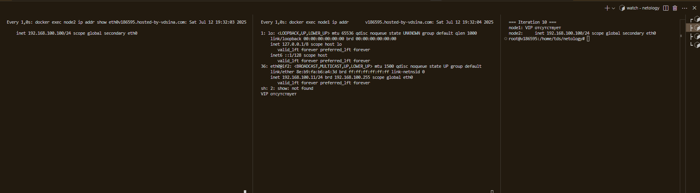

# Домашнее задание: Disaster Recovery и Keepalived

**Автор**: Дмитрий Тутубалин

---

## Содержание

- [Задание 1: HSRP Advanced](#задание-1-hsrp-advanced)
- [Задание 2: Keepalived](#задание-2-keepalived)

---

## Задание 1: HSRP Advanced

Дана схема для Cisco Packet Tracer, рассматриваемая в лекции. Необходимо настроить отслеживание состояний интерфейсов:

- Gi0/1 (нулевая группа) — уже настроено.
- Gi0/0 (первая группа) — настройте аналогично.

Для проверки настройки разорвите кабель между одним из маршрутизаторов и Switch0 и запустите `ping` между PC0 и Server0.

**Схема проекта**:  
[hsrp_advanced.pkt](./hsrp_advanced.pkt)

**Приоритеты**:

| Маршрутизатор | Приоритет | decrement (по умолчанию) |
|:-------------:|:---------:|:------------------------:|
| Router1       | 110       | 10                       |
| Router0       | 101       | 10                       |

**Скриншоты настройки HSRP**:

| Группа 0: Gi0/1 | Группа 1: Gi0/0 |
|:---------------:|:---------------:|
|  |  |

---

## Задание 2: Keepalived

Запустите две виртуальные машины Linux, установите и настройте сервис Keepalived как в лекции, используя пример конфигурационного файла, и организуйте проверку состояния веб-сервера.

1. **Пример конфигурационного файла Keepalived**:  
   [node/keepalived.tmpl](./node/keepalived.tmpl)
2. **Bash-скрипт для проверки веб-сервера**:  
   [node/check_web.sh](./node/check_web.sh)

Настройте любой веб-сервер (например, nginx или простой Python-сервер) на обеих виртуальных машинах.  
Добавьте секцию `vrrp_script` в Keepalived, чтобы запускать скрипт каждые 3 секунды. При ненулевом коде выхода скрипта виртуальный IP должен перемещаться на резервный сервер.

**Скриншоты переключения плавающего IP**:

| Активный сервер: основной | Активный сервер: резервный |
|:-------------------------:|:--------------------------:|
|  |  |

---
